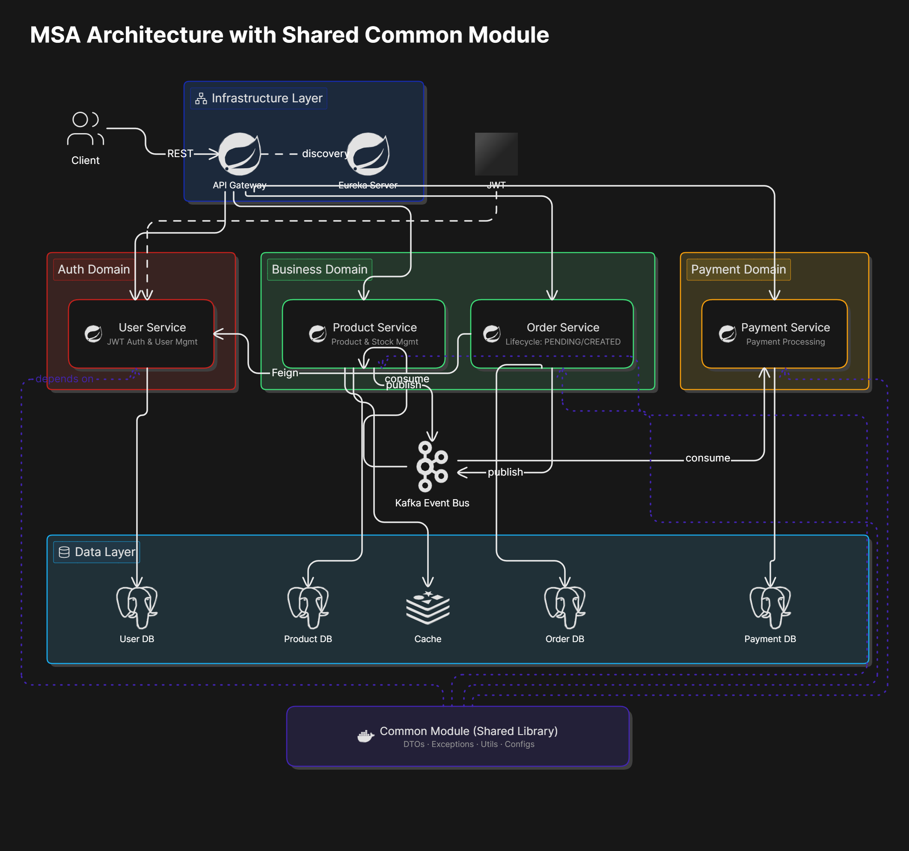
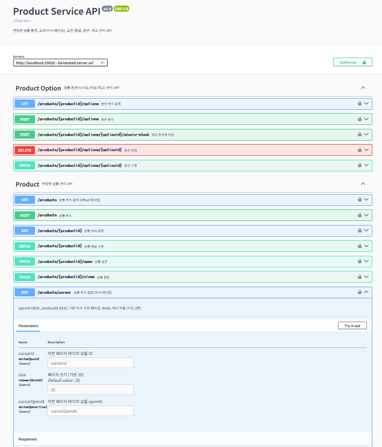

# 🚀 Limited-Edition-Commerce-Platform
> **한정판 상품 선착순 구매를 위한 이벤트 기반 MSA 백엔드 프로젝트**

<br>

## 📄 목차
- [1. 프로젝트 소개](#1-프로젝트-소개)
- [2. 기술 스택](#2-기술-스택)
- [3. 시스템 아키텍처](#3-시스템-아키텍처)
- [4. 성능 개선 및 문제 해결](#4-성능-개선-및-문제-해결)
- [5. 기술적 의사결정](#5-기술적-의사결정)
- [6. 트러블 슈팅](#6-트러블-슈팅)
- [7. 테스트 전략](#7-테스트-전략)
- [8. 주요 특징](#8-주요-특징)
- [9. 모니터링](#9-모니터링)
- [10. API 문서](#10-api-문서)
- [11. 로컬 인프라 및 실행 방법](#11-로컬-인프라-및-실행-방법)
- [12. CI/CD 파이프라인](#12-CI/CD-파이프라인)
---

## 1. 프로젝트 소개

Limited-Edition-Commerce-Platform은 특정 시간에 오픈되는 **한정판 상품을 선착순으로 구매**하는 커머스 서비스입니다.

본 프로젝트는 단순한 기능 구현보다는 기본적인 CRUD 기반 서비스 구현 이후, **동시 요청 상황에서 발생하는 문제를 직접 재현**하고 이를 단계적으로 개선하는 과정을 경험하는 것을 목표로 합니다.

초기 단계에서는 필수적인 기능만 구현하고, 프로젝트 진행 과정에서 트래픽 증가 및 분산 환경을 가정한 개선을 점진적으로 적용하고 있습니다.

● **개발 기간:** 2026.01 ~ 진행 중
● **개발 인원:** 1인 (Backend)

---

## 2. 기술 스택

### **Backend**
● Java 21
● Spring Boot 3.2.1
● Spring Web / Spring Data JPA
● QueryDSL / Spring Security

### **MSA / Infrastructure**
● Spring Cloud Gateway
● Netflix Eureka
● OpenFeign

### **Database & Messaging**
● PostgreSQL (RDB)
● Redis (Cache)
● Apache Kafka (Messaging)

### **DevOps & Monitoring**
● GitHub Actions (CI)
● Docker Compose
● Prometheus / Grafana

### **Documentation & Test**
● springdoc-openapi (Swagger UI)
● JUnit 5 / JMeter

| 분류 | 기술 | 선정 이유 |
| :--- | :--- | :--- |
| Language & Framework | Java 21, Spring Boot | 안정적인 백엔드 생태계 및 높은 생산성 |
| Database | PostgreSQL, JPA | 데이터 정합성 보장 및 객체 중심 설계 |
| Cache & Message | Redis, Apache Kafka | 조회 성능 최적화 및 비동기 서비스 연동 |
| Architecture | MSA, Monorepo | 서비스별 독립적 확장 및 코드 관리 효율화 |
| CI/CD | GitHub Actions, Docker | push 시 자동 빌드/테스트 및 인프라 통합 관리 |
| Monitoring | Prometheus, Grafana | 실시간 메트릭 수집 및 시각화 |
| Test | JUnit 5, JMeter | 동시성/멱등성 자동 검증 및 부하 테스트 |
| API Docs | springdoc-openapi | Swagger UI 기반 API 명세 자동화 |

---

## 3. 시스템 아키텍처
**

> **Gateway를 통한 라우팅 및 Kafka 기반의 비동기 이벤트를 활용한 서비스 간 결합도 해소**

---

## 4. 성능 개선 및 문제 해결

> **JMeter를 활용하여 수치 기반의 성능 개선 결과를 도출했습니다.**

### 📈 1. 상품 조회 성능 최적화: Offset → Cursor 전환
● **문제 상황:** 데이터 양이 증가함에 따라 기존 Offset 방식의 페이징 조회 성능이 급격히 저하됨.

● **해결 방안:**

● **Cursor Pagination:** 불필요한 Offset 스캔을 제거하여 탐색 비용 최소화.

● **복합 인덱스:** `(open_at DESC, product_id DESC)` 인덱스를 Product 엔티티에 선언하여 정렬 및 탐색 속도 최적화.

● **캐싱 전략:** Redis `@Cacheable` 적용 (TTL 3분) 및 상품 생성/수정/오픈/종료 시 `@CacheEvict`로 캐시 정합성 보장.

| 성능 지표 | 기존 Offset Paging | Cursor + Index + Redis | 개선 결과 |
| :--- | :---: | :---: | :---: |
| 평균 응답시간 | 2,940ms | **641ms** | **약 4.5배 개선** |
| 최대 응답시간 | 8,820ms | **1,458ms** | **약 6배 개선** |
| 처리량 (TPS) | 215 TPS | **620 TPS** | **약 2.9배 증가** |

### 📈 2. 주문 처리 병목 개선: 비동기 Saga 패턴 도입
● **문제 상황:** 동기(Sync) 재고 차감 요청 시 DB Row Lock 대기로 인한 응답 지연 및 시스템 결합도 심화.

● **해결 방안:**

● **Kafka 기반 Saga 패턴:** 주문 생성과 재고 차감을 비동기로 분리하여 스레드 차단 방지.

● **트랜잭션 정합성:** `@TransactionalEventListener`로 DB 커밋 이후 이벤트 발행 보장.

● **멱등성 보장:** `processed_event` 테이블을 활용한 중복 메시지 처리 방지 (Product, Order 양쪽 Consumer 모두 적용).

| 성능 지표 | 동기 Feign 처리 | Kafka 비동기 처리 | 개선 결과 |
| :--- | :---: | :---: | :---: |
| 평균 응답시간 | 4,004ms | **90ms** | **약 44배 개선** |
| 최대 응답시간 | 49,607ms | **357ms** | **약 140배 개선** |
| 처리량 (TPS) | 18 TPS | **94 TPS** | **약 5배 증가** |

---

## 5. 기술적 의사결정

### 멱등성 및 정합성 보장
● **배경:** Kafka의 At Least Once 전달 정책 특성상 네트워크 재시도 등으로 인해 동일 메시지가 중복 소비될 가능성이 존재.

● **해결:** Product Service와 Order Service 양쪽 Consumer에 `processed_event` 테이블을 생성하여 소비된 `event_id(UUID)`를 관리. MSA에서 서비스별 DB가 분리되어 있으므로 각 서비스가 독립적으로 멱등성 테이블을 관리하는 것이 원칙에 부합.

● **로직:** `existsById(eventId)`를 통해 중복 여부를 체크하며, DB 트랜잭션 내에서 비즈니스 로직과 이벤트 기록을 원자적으로 처리.

● **결과:** 네트워크 장애 상황에서도 **재고 중복 차감 사고 0건** 달성.

### Kafka 기반 Saga 패턴 및 최종 일관성

● **배경:** 동기 호출(Feign) 방식은 서비스 간 강한 결합을 유발하고, 특정 서비스 장애 시 전체 시스템으로 장애가 전파되는 리스크가 있음.

● **해결:** 서비스 간 결합도를 낮추고 가용성을 높이기 위해 Choreography Saga 패턴을 도입.

● **프로세스:**
주문 생성(PENDING) → Kafka 이벤트 발행 → 상품 서비스 재고 차감 → 결과 이벤트 발행.

● **보상 트랜잭션:** 재고 부족 시 `stock-result(FAIL)` 발행 → 주문 서비스에서 주문 상태를 `FAILED`로 자동 롤백.

● **이점:** 서비스 장애 시에도 메시지 큐를 통해 요청이 보존되어 데이터의 **최종 일관성** 유지.

### 원자적 UPDATE 기반 재고 차감

● **배경:** 단순 `findById → set → save` 방식은 동시 요청 시 Lost Update 문제 발생.

● **비교 검토:** 비관적 락(`SELECT FOR UPDATE`)과 원자적 UPDATE를 모두 구현하여 비교.

● **선택:** `UPDATE ... SET remain_stock = remain_stock - :quantity WHERE remain_stock >= :quantity` 원자적 UPDATE 방식 채택. DB가 원자적으로 조건 검증과 차감을 수행하므로 별도 락 획득/대기 없이 정확한 재고 관리가 가능.

● **결과:** 락 경합 없이 동시 150명 요청에서 재고 100개가 정확히 0개로 차감됨을 테스트로 검증.

### Kafka DLQ (Dead Letter Queue) 전략

● **배경:** Consumer가 처리 불가능한 메시지(poison message)를 만나면 무한 재시도에 빠져 후속 메시지 처리가 차단될 위험.

● **해결:** `DefaultErrorHandler`를 활용하여 1초 간격 최대 3회 재시도 후 실패 시 DLQ 토픽(`*.DLT`)으로 전송.

● **세부 전략:** `BusinessException`(주문 미존재, 존재하지 않는 상품 등)은 재시도해도 결과가 동일하므로 `addNotRetryableExceptions`로 등록하여 즉시 DLQ 전송. 네트워크 타임아웃 등 일시적 장애만 재시도 대상으로 분류.

● **DLQ 토픽:** `stock-decrease.DLT`, `stock-result.DLT`

### 1인당 구매 수량 제한

● **배경:** 한정판 커머스에서 1인 다량 구매(매크로 등)를 방지하는 것은 핵심 비즈니스 규칙.

● **해결:** 주문 생성 시 해당 사용자의 기존 주문 수량을 집계하고, `maxPurchasePerUser` 초과 여부를 검증. 실패(FAILED)/취소(CANCELED) 주문은 집계에서 제외하여 정상 유저의 재주문을 보장.

---

## 6. 트러블 슈팅

### 1. 대용량 데이터 조회 시 응답 속도 저하 (Offset Pagination)
● **문제:** 10만 건 이상의 데이터에서 뒤 페이지로 갈수록 **Full Scan 비용**으로 인해 응답 시간이 3초대까지 급증.

● **원인:** Offset 방식은 이전 데이터를 모두 읽고 버리는 특성 때문에 정렬 및 스캔 비용이 비례해서 증가함.

● **해결:** **Cursor Pagination**과 **복합 인덱스** 적용으로 탐색 비용을 $O(N)$에서 $O(log N)$ 수준으로 개선.

● **결과:** 평균 응답 시간 **2,940ms → 641ms** (약 78% 단축).

### 2. 동기 호출(Feign)로 인한 주문 서비스 병목
● **문제:** 주문 시 상품 서비스의 재고 차감을 기다리는 동안 **스레드 점유 시간**이 길어져 전체 TPS가 급감 (18 TPS).

● **원인:** 동기 방식은 응답 대기 시간 동안 커넥션 풀을 반환하지 못하며, DB Row Lock 대기가 누적됨.

● **해결:** **Apache Kafka**를 도입하여 비동기 **Saga 패턴**으로 전환. 주문 요청은 즉시 응답하고 재고 처리는 이벤트로 분리.

● **결과:** 평균 응답 시간 **4,004ms → 90ms** (약 44배 향상).

### 3. Kafka 중복 Consume 및 데이터 정합성 이슈
● **문제:** Kafka의 At Least Once 특성상 이벤트가 중복 전달될 경우 **재고가 이중 차감**될 위험 발생.

● **해결:** **멱등성 테이블(`processed_event`)**을 활용하여 `event_id`를 PK로 관리. 소비 전 중복 여부를 체크하는 **Consumer-side Idempotency**를 Product Service와 Order Service 양쪽에 구현.

### 4. DB 트랜잭션 롤백과 이벤트 발행의 불일치
● **문제:** 주문 DB 저장은 실패했으나 Kafka 메시지는 이미 발행되어, 존재하지 않는 주문의 재고가 차감되는 현상 발생 가능성.

● **해결:** **`@TransactionalEventListener(AFTER_COMMIT)`**를 적용. DB 트랜잭션이 최종 커밋된 후에만 이벤트를 발행하도록 시점 분리.

### 5. Consumer 예외 발생 시 비즈니스 로직 롤백 문제
● **문제:** 재고 부족 시 `RuntimeException`을 던지자 **트랜잭션 전체가 롤백**되어 멱등성 이력(`processed_event`)조차 남지 않고 중복 재시도 루프에 빠짐.

● **해결:** 재고 부족을 시스템 예외가 아닌 **비즈니스 실패**로 정의. 예외를 던지는 대신 **결과값(boolean)을 반환**받아 멱등성 기록과 실패 이벤트(`stock-result-fail`) 발행을 정상 트랜잭션 내에서 처리하도록 개선.

### 6. 캐시 정합성 문제 — @Cacheable 적용 후 캐시 무효화 누락
● **문제:** 상품 목록 조회에 `@Cacheable`을 적용했으나, 상품 생성/수정/오픈/종료 시 캐시를 무효화하지 않아 TTL(3분) 동안 변경 사항이 반영되지 않음. 한정판 오픈 직후 목록에 상품이 안 보이는 치명적 상황 발생.

● **해결:** `ProductCommandServiceImpl`의 create/update/open/close 메서드에 `@CacheEvict(value = "products", allEntries = true)` 적용. 커서 페이징 캐시 키가 다양한 조합이므로 `allEntries = true`로 전체 evict. 상품 변경은 빈도가 낮으므로 성능 영향 미미.

---

## 7. 테스트 전략

> **"성능을 개선했다"는 주장을 JMeter 수치뿐 아니라 자동화된 테스트 코드로 검증합니다.**

### 동시성 테스트 — 재고 원자적 차감 검증
● `ExecutorService` + `CountDownLatch`로 150개 스레드가 동시에 재고 100개를 차감하는 테스트.

● **검증:** 성공 100건, 실패 50건, 잔여 재고 정확히 0개.

● **의미:** 원자적 UPDATE 쿼리가 동시 요청에서 Lost Update 없이 정확하게 동작함을 증명.

### 멱등성 테스트 — 중복 이벤트 방어 검증
● 동일한 `eventId`로 `StockProcessService.process()`를 2회 호출하는 테스트.

● **검증:** 재고가 1번만 차감되고, `processed_event`에 의해 두 번째 호출이 무시됨.

● **의미:** Kafka At Least Once 환경에서 중복 소비 시에도 데이터 정합성이 보장됨을 증명.

### Saga 보상 트랜잭션 테스트
● 재고 부족(`isSuccess = false`) 결과 이벤트를 수신했을 때 주문 상태가 FAILED로 롤백되는지 검증.

● **의미:** Choreography Saga의 보상 흐름이 정상 동작함을 증명.

### CI 자동화
● **GitHub Actions:** dev/main 브랜치 push 시 자동으로 전체 빌드 + 테스트 실행.

● **서비스 컨테이너:** PostgreSQL, Redis를 CI 환경에서 Docker로 구동하여 통합 테스트 환경 구성.

● **테스트 리포트:** 실패 시 HTML 리포트를 아티팩트로 업로드하여 원인 분석 지원.

---

## 8. 주요 특징

● **MSA 통신:** OpenFeign을 활용한 선언적 HTTP 통신 및 로드밸런싱 적용.

● **분산 환경 대응:** Kafka 환경을 고려한 멱등성, DLQ 전략, 이벤트 발행 보장 설계.

● **재고 정합성:** 원자적 UPDATE 기반 재고 차감 + 동시성 테스트 코드로 정확성 검증.

● **비즈니스 규칙:** 1인당 구매 수량 제한 및 실패/취소 주문 제외 집계.

● **보안:** JWT 및 Spring Security를 이용한 Role 기반 접근 제어. 내부 API 시크릿은 환경변수 분리.

● **모니터링:** Prometheus + Grafana 기반 실시간 메트릭 수집 (TPS, 응답시간, JVM, Kafka Lag).

● **API 문서:** springdoc-openapi(Swagger UI) 기반 API 명세 자동화.

● **CI:** GitHub Actions를 활용한 push 시 자동 빌드/테스트 파이프라인 구성.

● **인프라:** Docker Compose를 이용한 전체 인프라(Kafka/Redis/PostgreSQL/Prometheus/Grafana) 통합 관리.

---

## 9. 모니터링

> **Prometheus + Grafana 기반 실시간 모니터링 구성**

● Spring Actuator + Micrometer Prometheus 레지스트리를 통해 각 서비스의 메트릭을 `/actuator/prometheus`로 노출.

● Prometheus가 5개 서비스(user, product, order, payment, gateway)를 15초 간격으로 스크레이핑.

● Grafana 대시보드에서 주요 지표를 실시간 시각화.

.png)

| 패널 | 모니터링 대상 | 의미 |
| :--- | :--- | :--- |
| HTTP Request Rate | 초당 요청 처리량 (TPS) | 부하 시 처리 능력 확인 |
| HTTP Response Time (p99) | 99th 백분위 응답 시간 | 최악 케이스 응답 지연 확인 |
| JVM Heap Memory | 힙 메모리 사용량 | OOM 위험 사전 감지 |
| Kafka Consumer Lag | 메시지 처리 지연 | Saga 이벤트 소비 속도 확인 |

---

## 10. API 문서

> **springdoc-openapi(Swagger UI)를 통한 API 명세 자동화**

각 서비스 실행 후 Swagger UI에서 API를 확인하고 테스트할 수 있습니다.

| 서비스 | Swagger UI 경로 | 주요 API |
| :--- | :--- | :--- |
| User Service | `/swagger-ui/index.html` | 회원가입, 로그인, 내 정보 조회/수정 |
| Product Service | `/swagger-ui/index.html` | 상품 등록, 커서 페이징 조회, 오픈/종료, 옵션 관리 |
| Order Service | `/swagger-ui/index.html` | 주문 생성(Saga 기반), 주문 취소 |
| Payment Service | `/swagger-ui/index.html` | 결제 생성(멱등성), 결제 조회/취소 |

● JWT Bearer 인증 지원 — Swagger UI의 "Authorize" 버튼에서 토큰 입력 후 인증 필요 API 테스트 가능.

● Internal API(서비스 간 통신용)는 Swagger에 노출하지 않음.

---

## 11. 로컬 인프라 및 실행 방법

### Infrastructure

● **Storage:** PostgreSQL (Persistence), Redis (Cache)

● **Messaging:** Apache Kafka, Zookeeper (Local Cluster)

● **Monitoring:** Prometheus (메트릭 수집), Grafana (시각화)

● **Strategy:** `docker-compose.yml`을 통해 원클릭으로 개발 환경 구축 가능.

---

## 12. CI/CD 파이프라인

> **GitHub Actions 기반 자동화된 빌드 → 테스트 → 이미지 배포 파이프라인**

### 파이프라인 흐름

● **dev push / PR** → CI만 실행 (빌드 + 테스트)

● **main push** → CI 성공 → CD 실행 (Docker 이미지 빌드 + GHCR 푸시)

● CI가 실패하면 CD는 실행되지 않아, 검증되지 않은 이미지가 배포되는 것을 방지.

### CI (Continuous Integration)

● GitHub Actions에서 push/PR 시 자동으로 `./gradlew build` 실행.

● PostgreSQL, Redis를 서비스 컨테이너로 구동하여 동시성/멱등성/Saga 통합 테스트 실행.

● 테스트 실패 시 HTML 리포트를 아티팩트로 업로드하여 원인 분석 지원.

### CD (Continuous Delivery)

● **멀티스테이지 Dockerfile:** JDK로 빌드 → JRE만 포함된 경량 이미지로 패키징 (약 50% 크기 절감).

● **단일 Dockerfile로 6개 서비스 빌드:** `ARG SERVICE_NAME`으로 서비스를 구분하여 하나의 Dockerfile로 모든 서비스를 이미지화.

● **Matrix 전략으로 병렬 빌드:** 6개 서비스를 동시에 빌드하여 전체 CD 시간 단축.

● **GHCR(GitHub Container Registry)에 이미지 푸시:** `latest` + `sha-{커밋해시}` 이중 태그로 최신 추적 및 커밋별 롤백 가능.

● **비루트(non-root) 사용자 실행:** 컨테이너 보안을 위해 `app` 사용자로 애플리케이션 실행.

### 이미지 태그 전략

| 태그 | 용도 |
| :--- | :--- |
| `latest` | 항상 최신 빌드를 가리킴 |
| `sha-{커밋해시}` | 특정 커밋으로 빌드된 이미지 추적 및 롤백 |

### 실배포를 하지 않은 이유

MSA 6개 서비스 + Kafka + Redis + PostgreSQL을 클라우드에 상시 운영하면 월 5~10만원 이상의 비용이 발생합니다. 포트폴리오 목적상 이미지 빌드/푸시 파이프라인까지 구성하고, 로컬에서는 docker-compose로 전체 서비스를 띄워 통합 검증을 수행했습니다.

---
### 🛠 실행 방법
```bash
# 1. 컨테이너 인프라 실행 (PostgreSQL, Redis, Kafka, Prometheus, Grafana)
docker-compose up -d

# 2. 애플리케이션 실행
./gradlew bootRun

# 3. Swagger UI 접속
# http://localhost:{서비스포트}/swagger-ui/index.html

# 4. Prometheus 확인
# http://localhost:9090 → Status → Targets

# 5. Grafana 접속
# http://localhost:3000 (admin / admin)
# Data source 추가: http://prometheus:9090
# Dashboard Import: ID 19004 (Spring Boot 3.x)
```